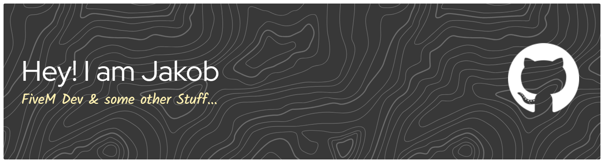

# 👋 Hey, I'm JakobKaiserDev  
### 🔧 FiveM Developer • Lua • JS/TS • UI/UX • Server Systems

I develop modern, clean and high-performance FiveM scripts – from framework extensions to complete standalone systems.  
My focus: **quality, stability, design & performance.**

---

## 🚀 Tech Stack

### **Languages**

   
  
  
  
  
  
  

### **FiveM / Game Development**
- ⚡ FiveM Natives  
- 🎮 ESX / QB-Core  
- 🟦 ox_lib  
- 🖥️ NUI (HTML / CSS / JS)  
- 🚀 GTA V API  

### **Tools**

  
  
  

---

## 🛠️ Featured Projects
- 🔹 Custom NUI Design System  
- 🔹 Optimized MLO / texture reduction workflows  
- 🔹 Custom ESX & QB-Core scripts  
- 🔹 Anti-lag utility tools  
- 🔹 Server performance & stability upgrades  

---

## 📬 Contact
📩 **Discord:** `JakobKaiserDev`  
🗂️ **More Projects:** *(coming soon)*

---

## ❤️ Support
If you like my work, consider leaving a ⭐ on my repositories!
